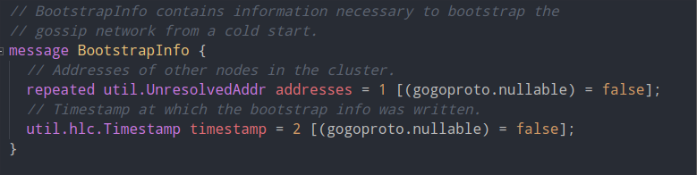
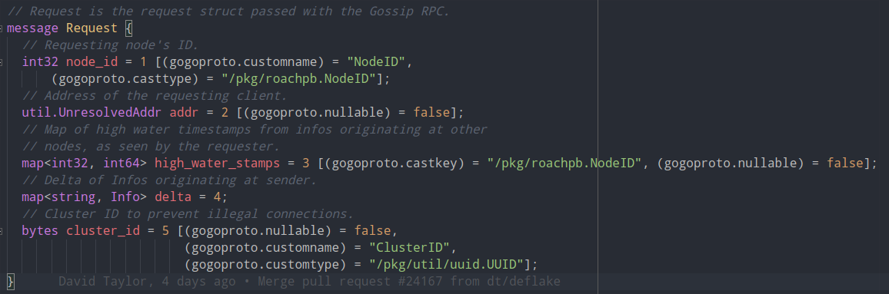
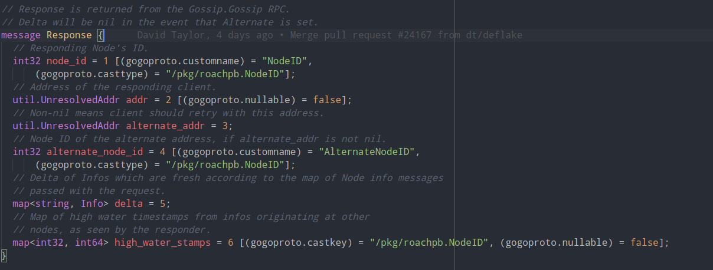
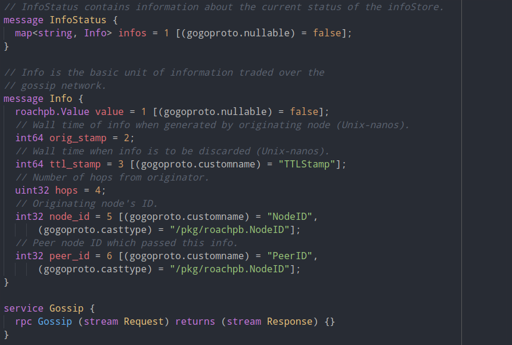

# 1 进度总结
GreatDB的alpha版本已经完成开发，已经进入与客户接触，客户进行试用测试的阶段。本项目作为GreatDB的Web监控系统，也同样基本完成，同步进入最终测试阶段。因为顺利完成这项工作，我已经拿到了公司的offer。

# 2 gossip 算法原理略复杂，实现难度较大，但代码量很小
```
client.go            doc.go        gossip.proto    infostore.go       keys.go       node_set.go       server.go        util.go
client_test.go       gossip.go     gossip_test.go  infostore_test.go  keys_test.go  node_set_test.go  simulation       util_test.go
convergence_test.go  gossip.pb.go  info.go         info_test.go       main_test.go  resolver          storage_test.go

      25 text files.
      25 unique files.
       0 files ignored.

github.com/AlDanial/cloc v 1.70  T=0.08 s (300.0 files/s, 98525.2 lines/s)
-------------------------------------------------------------------------------
Language                     files          blank        comment           code
-------------------------------------------------------------------------------
Go                              24            721           1285           6107
Protocol Buffers                 1              8             42             47
-------------------------------------------------------------------------------
SUM:                            25            729           1327           6154
-------------------------------------------------------------------------------
```

# 3 ui/src 只使用简单算法或者调用现有类库，实现难度较小，但代码量很大
```
hacks  index.tsx  interfaces  js  polyfills.ts  redux  routes  util  views

     164 text files.
     164 unique files.
      80 files ignored.

github.com/AlDanial/cloc v 1.70  T=0.89 s (94.6 files/s, 128524.0 lines/s)
-------------------------------------------------------------------------------
Language                     files          blank        comment           code
-------------------------------------------------------------------------------
JavaScript                       2           5091          25606          38604
TypeScript                      64           5854          25384          12673
Stylus                          18            178             16            672
-------------------------------------------------------------------------------
SUM:                            84          11123          51006          51949
-------------------------------------------------------------------------------
```

# 4 重点代码展示

## gossip.proto









# 5 成果展示