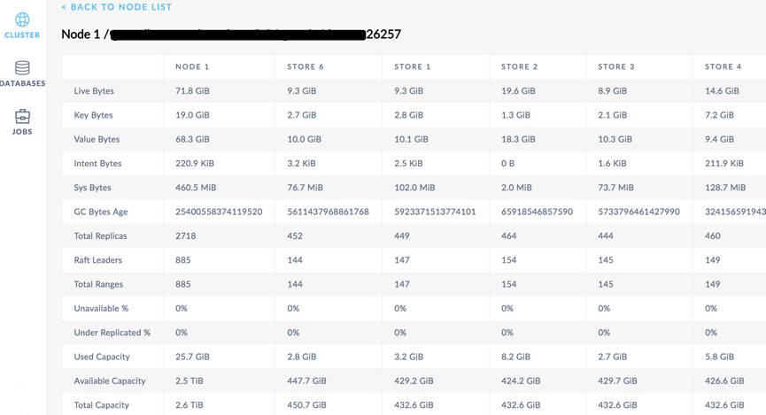

# 简介

Admin UI是GreatDB进程内部实现的Http Server，它展示了集群、节点、数据库的详细参数配置。用户可通过监控各状态参数来感知集群状态，进一步地调整参数，以优化集群的性能。在最新的1.1.0版本中，Admin UI主要包括了Clushter Health、SQL Performance、Replication Details等多个Dashboard，详细介绍如下：

Clushter Health，整个集群的健康状态信息，例如存活、死亡和不可用节点的数量，集群每秒的查询次数和集群的服务时延视图；

Overview Metrics，集群(或节点)的运行概括信息，例如当前SQL操作统计信息，SQL执行时延，每节点Replicas数量，集群容量的统计视图；

Runtime Metrics，集群节点的物理资源占用信息，例如集群存活节点数量，集群的内存使用情况（RSS、Go Layer使用情况，C Layer使用情况）、Go Goroutine 数量（随着集群负载动态变化），Go Garbage Collector（Go资源回收）、CPU占用时间等使用视图；

SQL Performance，集群节点SQL性能信息，例如SQL连接数量，SQL网络吞吐量，SQL操作（集群执行的SELECT、INSERT、UPDATE、DELETE的统计信息），DistSQL操作，SQL延迟等视图；

Storage Utilization，集群存储容量和存储引擎的概括信息，例如集群可用容量及总容量，Raft Log Commit延时，RocksDB SSTables数量，文件句柄数量等视图；

Replication Details，集群副本相关信息概括信息，例如集群Ranges的状态，各个Store的副本数量、各个Store的Leaseholders数量、KV写情况、Ranges操作情况（Splits、Adds、Removes）、Snapshots情况等视图；

Nodes Details，集群存活节点，死亡节点和停用节点等详细信息，包括各节点启动时间、内存使用情况、版本信息等视图；

Events，集群事件信息，包括Node Join情况,集群级别设置参数变更，库表创建，库表变更等事件信息；

Database Details，集群数据库简要信息，记录系统、用户数据库的数据表信息，例如表结构，表大小，表占用Ranges数量，表索引项数量等视图；

Jobs Details，集群Jobs的详细信息视图，包括备份、恢复、导入、Schema Changes等信息。

# 使用说明

用户可以通过集群中的任意一个节点去访问这个集群的Admin UI，入口地址跟集群启动的参数相关：

–http-host (HTTP服务绑定的IP地址，默认为机器名解析出的IP)

–http-port(HTTP服务绑定的端口，默认是8080)。

在默认配置下，通过浏览器输入http://<any node host>:8080，any node host为节点的ip地址或主机名即可访问，特别注意的是，当集群以secure模式启动时，GreatDB会以Https方式启动服务。

下图为访问Admin UI的首页：监控过去十分钟整个集群的概况。

## 页面栏目说明：

页面一般包含三列栏目，左栏是一级菜单，中间主体部分为曲线图，右栏为信息说明。

左栏可以选择监控的是集群CLUSTER、数据库DATABASES、备份/还原的信息JOBS。

中间主体为观察一段时间内集群或某一台机器，总体或某一项的状态，具体可通过GRAPH，DASHBOARD和时间跨度（默认为十分钟）来筛选。

右栏主要展示概要信息和事件信息。

### Summary 

通过集群概况可查看集群总数、已使用的存储空间大小以及不可用Ranges的数量，还有每秒的查询次数和集群的服务延迟。如下图，我们可以看出集群包括6个节点，存储量为115.2G，99分位的查询延时在6s左右等概括信息。

### SQL Queries

SQL Queries是我们从SQL层面查看集群负载信息的主要手段之一，它可查看SQL语句查询状态：如读写，更新，插入，删除的语句数量。从下图中我们可看出，当前集群INSERT QPS约为150，SELECT QPS 大约为200，集群流量变化相对平缓；

### Service Latency: 

SQL, 99th percentileService Latency是我们从SQL层查询集群SQL执行延时的主要手段之一，用于查看集群中每个节点的延时。如下图中我们可以看出，当前集群最高时延为151ms，基本没有慢查询。

### SQL Connections

SQL Connections是我们查看集群当前SQL连接数的主要手段之一，从下图中我们可以看出当前集群维持100左右连接数，集群状态比较平稳。

### Node List

GreatDB是分布式数据库，各个节点是否均衡对集群的性能有极大的影响。一般来说，我们可通过集群Ranges分布、Raft LeaseHolders分布、Replicas分布等初步判断集群节点是否处于均衡状态；

如下图所示，从Replicas per Store、Node List视图中，我们看看出各个节点间Replicas分布大致均衡且节点内Store分布大致均衡，集群处于较为均衡的状态。

### DATABASES TABLES VIEW

Admin UI还提供DATABASES TBALES相关的视图，让我们查看集群的数据库表信息和库表授权信息。

### JOBS

JOBS面板主要用来查看备份/还原状态信息。

