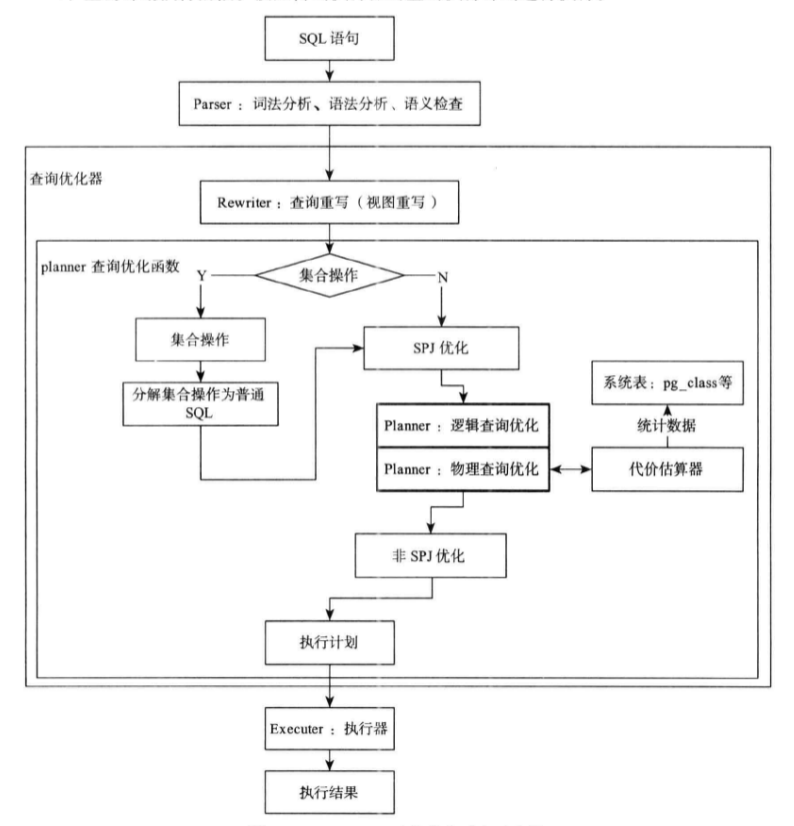

基于CockroachDB的分布式数据库查询优化器的实现

模块化可插拔的优化器

1.1 项目来源

本项目来源于北京万里开源软件有限公司的NewSQL数据库开发。

1.2 项目开发的目的和意义；

近年来，大数据迅速成为了工业界和学术界争相讨论的热点，甚至引起了国家层面的关注。与传统的数据相比，大数据具有数据规模庞大，速度快，形态多，识别困难以及价值大但价值密度低等特征。大数据系统通常需要解决如何高校存储数据，如何处理瞬间爆发的数据以及如何应对形态各异的结构化，半结构化以及非结构化数据。[6]

随之而来，对于海量异构数据的灵活管理及并行处理提出了更高要求，基于传统架构的数据库技术，在高扩展性，高性能等方面都难以应对，需要基于新型分布式数据库处理技术解决日益凸显的大数据管理及计算难题。[8]

所以北京万里开源软件公司决定暂停原有产品，MySQL数据库分布式中间件DBScale的后续功能开发，选择基于CockroachDB开发新一代的分布式数据库产品。

CockroachDB是基于谷歌分布式数据库Spanner/F1的思想实现的，新一代分布式数据库（NewSQL）。CockroachDB底层是由RocksDB实现键-值存储，通过Raft协议实现了数据的强一致性，在上层支持SQL语句，并支持强一致的ACID事务。

但CockroachDB在SQL支持方面的实现还很粗糙，TPC-C和TPC-H测试下表现出的性能还有待提高，所以在原有代码基础上，进行查询优化器的开发是十分必要的。

2. 国内外在该项目领域开发及应用的现状分析；

现有的分布式数据库由其面向用户的需求不同，主要分为三类：面向在线事务需求（OLTP），面向在线分析需求（OLAP），和同时支持在线事务、在线分析（HTAP）。

2.1 OLTP

在OLTP领域中，2012年，由Google发表的两篇论文[2][3]中所介绍的Spanner和F1是一个分水岭。在此前事务型分布式数据库领域，主要是由大量单机数据库通过数据库中间件形式，实现了分库分表数据分片等数据分布式存储的功能。

其中国外有，由MySQL官方开发的MySQL Proxy、MySQL Route，mariadb团队开发的MaxScale，Youtube的Vitess等;国内有阿里巴巴Cobar、Mycat，平民软件Oneproxy，金山Kingshard，360团队Atlas，以及万里开源DBScale等。

以上基于传统数据库的中间件软件的优点是，与传统数据库的操作和协议上高度兼容，开发人员的学习成本和数据迁移成本较低，但事务一致性级别较低，数据库水平扩展能力也受限于传统数据库自身的缺点，没有特别优秀的解决方案。

而Google的Spanner/F1通过原子钟和GPS提供全局时间戳，通过Paxos协议解决了数据一致性问题，并设计了专门的事务模型提供了强大的事务处理能力，为全世界数据库系统开发人员提供了一个新的方向。

目前基于Spanner/F1思想实现的数据库系统，已经比较成熟正逐步投入生产环境的，主要有两家，国内平凯星辰的TiDB和国外的CockroachDB。

2.2 OLAP

目前OLAP场景下，主要使用大数据计算框架而非数据库系统，而大数据计算框架主要包括针对历史静态数据的批处理框架，如Google提出的MapReduce和MapReduce的开源实现Hadoop;针对快速流式数据的处理框架，如Twitter的Storm;针对交互式计算的处理框架，如Apache基金会的Spark。[6]

当下国内互联网公司，主要是使用hive或SparkSQL等SQL-on-Hadoop软件。其优点是生态系统比较完善，有各种成熟的工具;缺点是底层存储与传统数据库不兼容，需要通过如Sqoop等工具进行数据迁移或者实时的数据同步，不能做到真正意义上的在线数据分析。

2.3 HTAP

在今年的云栖大会上，阿里公布了HTAP-on-MySQL产品，通过事务/分析双引擎的架构，实现了在不进行数据迁移的情况下进行对数据的在线分析。平凯星辰也通过对Spark框架的外部扩展TiSpark，实现了能直接分析其底层键值存储TiKV上数据的功能。CockroachDB官方并没有相关跟进。

3. 主要开发/设计内容、需求分析及总体设计方案；

3.1 主要开发内容

3.2 需求分析

3.3 总体设计方案

4. 开发环境和开发工具；

5. 项目进度安排、预期达到的目标；

6. 为完成项目已具备和所需的条件和经费；

7. 预计开发/设计过程中可能遇到的困难、问题及解决的措施；

8. 主要参考文献。 

[1] 邹承明，谢义，吴佩. 2017湖北CS推荐-基于Greenplum数据库的查询优化[J/OL]. 计算机应用, 2017.
http://www.joca.cn/CN/abstract/abstract21080.shtml.

[2] Jeff Shute，Chad Whipkey，David Menestrina，Radek Vingralek，Bart Samwel，Ben Handy，Eric Rollins，Mircea Oancea Kyle Littlefield，Stephan Ellner John Cieslewicz，Ian Rae*，Traian Stancescu，Himani Apte:
F1: a distributed SQL database that scales[J]. Proceedings of the VLDB Endowment，2013，6（11）：1068-1079.

[3] James C. Corbett, Jeffrey Dean, Michael Epstein, Andrew Fikes, Christopher Frost, JJ Furman, Sanjay Ghemawat, Andrey Gubarev, Christopher Heiser, Peter Hochschild, Wilson Hsieh, Sebastian Kanthak, Eugene Kogan, Hongyi Li, Alexander Lloyd, Sergey Melnik, David Mwaura, David Nagle, Sean Quinlan, Rajesh Rao, Lindsay Rolig, Yasushi Saito, Michal Szymaniak, Christopher Taylor, Ruth Wang, Dale Woodford: Spanner: Google’s Globally-Distributed Database[J]. ACM Transactions on Computer Systems (TOCS)，2013，31（3）：73-95.

[4] Andrew Pavlo，Matthew Aslett：What’s Really New with NewSQL?[J]. ACM SIGMOD Record，2016, 45（2）：45-55.

[5] 齐磊：大数据分析场景下分布式数据库技术的应用[J]. 移动通信，2015，39（12）：58-62.

[6] 陈军成，丁治明，高需：大数据热点技术综述[J]. 北京工业大学学报，2017，43（3）：358-367.

[7] 崔星灿，禹晓辉，刘洋，吕朝阳：分布式流处理技术综述[J]. 计算机研究与发展，2015，52（2）：318-332.

[8] 杨东，谢菲，杨晓刚，何遵文：分布式数据库技术的研究与实现[J]. 电子科学技术，2015，2（1）：87-94.

[9] 王春凯，孟小峰：分布式数据流关系查询技术研究[J]. 计算机学报，2016，39（1）：80-96.

[10] 崔跃生，张勇，曾春，冯建华，邢春晓：数据库物理结构优化技术[J]. 软件学报，2013，24（4）：761-780.

[11] 潘巍，李战怀，杜洪涛，周陈超，苏 静：新型非易失存储环境下事务型数据管理技术研究[J]. 软件学报，2017，28（1）：59-83.