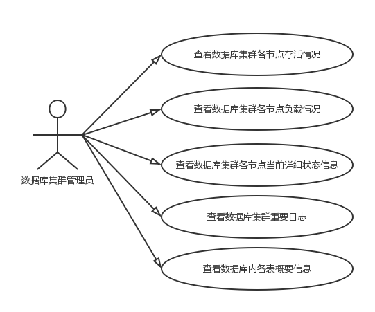

分布式数据库GreatDB的Web图形化监控软件实现

1.1 项目来源

本项目来源于北京万里开源软件有限公司的分布式数据库GreatDB开发。

1.2 项目开发的目的和意义；

近年来，大数据迅速成为了工业界和学术界争相讨论的热点，甚至引起了国家层面的关注。与传统的数据相比，大数据具有数据规模庞大，速度快，形态多，识别困难以及价值大但价值密度低等特征。大数据系统通常需要解决如何高校存储数据，如何处理瞬间爆发的数据以及如何应对形态各异的结构化，半结构化以及非结构化数据。[6]

随之而来，对于海量异构数据的灵活管理及并行处理提出了更高要求，基于传统架构的数据库技术，在高扩展性，高性能等方面都难以应对，需要基于新型分布式数据库处理技术解决日益凸显的大数据管理及计算难题。[8]

所以北京万里开源软件公司决定暂停原有产品，MySQL数据库分布式中间件DBScale的后续功能开发，选择基于谷歌的Spanner/F1开发新一代的分布式数据库GreatDB，于是对GreatDB的图形化监控系统的需求也就应运而生。

2. 国内外在该项目领域开发及应用的现状分析；

现有的分布式数据库由其面向用户的需求不同，主要分为三类：面向在线事务需求（OLTP），面向在线分析需求（OLAP），和同时支持在线事务、在线分析（HTAP）。

2.1 OLTP

在OLTP领域中，2012年，由Google发表的两篇论文[2][3]中所介绍的Spanner和F1是一个分水岭。在此前事务型分布式数据库领域，主要是由大量单机数据库通过数据库中间件形式，实现了分库分表数据分片等数据分布式存储的功能。

其中国外有，由MySQL官方开发的MySQL Proxy、MySQL Route，mariadb团队开发的MaxScale，Youtube的Vitess等;国内有阿里巴巴Cobar、Mycat，平民软件Oneproxy，金山Kingshard，360团队Atlas，以及万里开源DBScale等。

以上各种中间件系统因为并没有相应需求或者其他原因，并没有原生的图形化监控软件或者功能比较简陋。

而Google的Spanner/F1通过原子钟和GPS提供全局时间戳，通过Paxos协议解决了数据一致性问题，并设计了专门的事务模型提供了强大的事务处理能力，为全世界数据库系统开发人员提供了一个新的方向。但谷歌并未开源相关实现，也未提及是否有相应的图形化监控软件。

目前基于Spanner/F1思想实现的数据库系统，已经比较成熟正逐步投入生产环境的，主要有两家，国内平凯星辰的TiDB和国外的CockroachDB，都拥有有在不断迭代开发的图形化监控软件。

2.2 OLAP

目前OLAP场景下，主要使用大数据计算框架而非数据库系统，而大数据计算框架主要包括针对历史静态数据的批处理框架，如Google提出的MapReduce和MapReduce的开源实现Hadoop;针对快速流式数据的处理框架，如Twitter的Storm;针对交互式计算的处理框架，如Apache基金会的Spark。[6]

而Spark的图形化监控软件已经比较成熟。

2.3 HTAP

在今年的云栖大会上，阿里公布了HTAP-on-MySQL产品，通过事务/分析双引擎的架构，实现了在不进行数据迁移的情况下进行对数据的在线分析。以阿里以往在云产品上面的开发来看，有理由相信阿里会为HTAP-on-MySQL开发一款强大易用的图形化监控软件。

3. 主要开发/设计内容、需求分析及总体设计方案；

3.1 主要开发内容

本数据库监控系统需要开发的主要功能有：

（1）基于NodeJS的图形化监控界面；

（2）分布式数据库集群各节点当前状态信息总览界面；

（3）集群各节点当前状态信息详细展示界面：运行时，SQL，存储，备份，分布，队列，慢请求等；

（4）集群事件日志和作业日志信息展示；

（5）数据库内各表信息概要展示；

（6）对以上各类数据选择合适的图表进行动态展示。

3.2 需求分析

本系统的用户只有一种身份，数据库集群管理员。

3.2.1 系统功能需求

（1）图形化信息展示模块

该模块作为其他模块都会调用的总功能模块，负责将可以通过命令交互界面获得的数据库集群信息，以合适的图表形式，转化成图形化交互界面的可视化信息，使各种信息更直观更易懂。

（2）集群各节点当前状态信息总览模块

该模块将各节点存活情况和负载状态汇总展示，能够帮助集群管理员第一时间获知各节点本身是否有特殊情况发生，从而及时地定位到具体节点服务器进行故障处理。

（3）集群各节点当前状态信息详细展示模块

该模块作为总览模块的扩展和补充，能够帮助集群管理员更准确地掌握数据库状态，更具体地定位问题。

（4）集群事件日志和作业日志信息展示模块

该模块提取了数据库集群上大粒度的关键日志进行展示，能够帮助管理员更快地追踪到问题出现的时间位置，以便后续的问题鉴别和处理。

（5）数据库内各表信息概要展示

该模块能够大体上展示数据库内各表的表结构、数据量、数据库用户权限和数据在集群不同节点间的实际物理分布等。能够让系统管理员对数据库集群所处理的相关业务有更直接的了解。

3.2.2 系统非功能需求

对数据库集群的信息展示应当是及时的（延迟应与网络通信延迟相当），准确的和稳定的（不会因任何合法操作而崩溃或出错）。

3.2.3 系统主要用例图

系统主要用例图如图3-1所示。

图3-1 系统主要用例图

3.3 总体设计方案

3.3.1 系统功能结构图、

系统功能结构图如图3-2所示。

图3-2 系统功能结构图

3.3.2 系统总体架构设计方案

为完成上述相应功能，系统总体架构设计如图3-3所示。用户在图形化界面上用鼠标点击操作发出请求，数据显示层将相应数据图表显示给用户；数据显示层将点击请求转化为相应的数据请求，传输给数据库接口层，并从数据处理层接收易于可视化的数据，然后转化为对应的图表；数据处理层负责接受数据库接口层回传的数据，进行统计处理，转化为易于可视化的数据；数据库接口层负责将数据请求翻译成SQL请求，发送给数据库集群，接收集群的数据回传后，将数据转发给数据处理层。

图3-3 系统架构图

3.3.3 系统预期部属方案

本系统部属是常见并简单的B/S（浏览器/服务器）结构。浏览器端推荐使用最新版本的Firefox和Chrome浏览器。服务器端使用NodeJS框架处理浏览器端发出的http请求，并与GreatDB其他功能模块代码编译打包到同一个二进制文件中，在GreatDB集群中的每一个节点服务器，都能作为本系统的http服务器来处理并响应来自浏览器请求。

3.3.4 系统界面原型设计方案

（1）首页

如图3-4所示，首页上有三个图表，分别显示节点状态统计，负载状态和节点信息统计列表。

图3-4 首页原型设计方案图

（2）集群状态页面

如图3-5所示，集群状态页面上有四个折线图来显示不同的集群状态信息，两张表格分别显示概要信息和事件日志。

图3-5 集群页面设计方案图

（3）数据库状态页面

如图3-6所示，数据库状态页面上会根据集群中存储的数据库数量，生成相应数量的表格来显示数据库的统计信息。

图3-6 数据库状态页面设计方案图

（4）日志状态页面

如图3-7所示，日志状态页面上有一个表格来显示重要事件和作业的日志信息。

图3-7 日志状态页面设计方案图

4. 开发环境和开发工具

4.1 开发语言

本系统主要使用NodeJS和golang语言开发。

4.2 开发工具

本系统使用Visual Studio Code作为主要开发平台，使用Firefox和Chrome浏览器进行图形化界面预览与调试。

如表4-1所示，本系统开发使用了这些开发工具。

表4-1 开发工具表

| 工具类别       | 工具名称             | 作用 |
| :-------------: |:-------------:     | :-----:|
| 集成开发环境    | Visual Studio Code | 程序最主要的开发调试平台 |
| 版本控制工具    | github             |   代码备份，版本控制 |

4.3 开发环境

操作系统：Ubuntu Linux 17.10/18.04
处理器：Intel Core i5，1.8GHz主频
内存：8GB 1600MHz DDR3
程序运行环境：Centos 7/Ubuntu Linux 17.10

5. 项目进度安排、预期达到的目标；

6. 为完成项目已具备和所需的条件和经费；

7. 预计开发/设计过程中可能遇到的困难、问题及解决的措施；

8. 主要参考文献。 

[1] 邹承明，谢义，吴佩. 2017湖北CS推荐-基于Greenplum数据库的查询优化[J/OL]. 计算机应用, 2017.
http://www.joca.cn/CN/abstract/abstract21080.shtml.

[2] Jeff Shute，Chad Whipkey，David Menestrina，Radek Vingralek，Bart Samwel，Ben Handy，Eric Rollins，Mircea Oancea Kyle Littlefield，Stephan Ellner John Cieslewicz，Ian Rae*，Traian Stancescu，Himani Apte:
F1: a distributed SQL database that scales[J]. Proceedings of the VLDB Endowment，2013，6（11）：1068-1079.

[3] James C. Corbett, Jeffrey Dean, Michael Epstein, Andrew Fikes, Christopher Frost, JJ Furman, Sanjay Ghemawat, Andrey Gubarev, Christopher Heiser, Peter Hochschild, Wilson Hsieh, Sebastian Kanthak, Eugene Kogan, Hongyi Li, Alexander Lloyd, Sergey Melnik, David Mwaura, David Nagle, Sean Quinlan, Rajesh Rao, Lindsay Rolig, Yasushi Saito, Michal Szymaniak, Christopher Taylor, Ruth Wang, Dale Woodford: Spanner: Google’s Globally-Distributed Database[J]. ACM Transactions on Computer Systems (TOCS)，2013，31（3）：73-95.

[4] Andrew Pavlo，Matthew Aslett：What’s Really New with NewSQL?[J]. ACM SIGMOD Record，2016, 45（2）：45-55.

[5] 齐磊：大数据分析场景下分布式数据库技术的应用[J]. 移动通信，2015，39（12）：58-62.

[6] 陈军成，丁治明，高需：大数据热点技术综述[J]. 北京工业大学学报，2017，43（3）：358-367.

[7] 崔星灿，禹晓辉，刘洋，吕朝阳：分布式流处理技术综述[J]. 计算机研究与发展，2015，52（2）：318-332.

[8] 杨东，谢菲，杨晓刚，何遵文：分布式数据库技术的研究与实现[J]. 电子科学技术，2015，2（1）：87-94.

[9] 王春凯，孟小峰：分布式数据流关系查询技术研究[J]. 计算机学报，2016，39（1）：80-96.

[10] 崔跃生，张勇，曾春，冯建华，邢春晓：数据库物理结构优化技术[J]. 软件学报，2013，24（4）：761-780.

[11] 潘巍，李战怀，杜洪涛，周陈超，苏 静：新型非易失存储环境下事务型数据管理技术研究[J]. 软件学报，2017，28（1）：59-83.